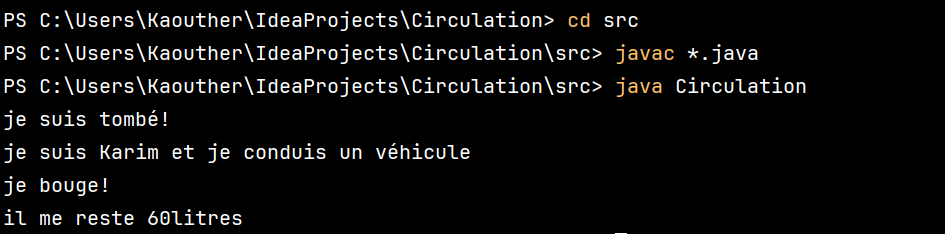

# Circulation Project 🚗🚲

Welcome to the Circulation Project! This Java-based project explores object-oriented programming concepts through simulating various vehicles' movements and driver actions. 

## Table of Contents

- [Description](#description) 📝
- [Features](#features) ✨
- [Explanations](#explanations) 🛠️
- [Usage](#usage) 🚀
- [Tools and Languages](#tools-and-languages) 🔧
- [Execution](#execution) 💻

## Description 📝

The Circulation Project simulates vehicular circulation scenarios, including automobiles, bicycles, and drivers' actions. It models interactions between different vehicle types and demonstrates the use of inheritance and polymorphism in object-oriented programming.

## Features ✨

- **Object-Oriented Modeling**: Utilizes classes and inheritance to model different types of vehicles and drivers.
- **Dynamic Actions**: Simulates various actions such as driving, falling (for bicycles), and refueling (for automobiles).
- **Polymorphism Demonstration**: Illustrates polymorphic behavior through the conduit method, allowing a single method to accept different types of vehicles, enhancing flexibility in handling diverse objects.
- **Error Handling**: Demonstrates runtime errors and how to resolve them using proper casting and class design.

## Explanations 🛠️

The project includes a `Circulation` class with a `main` method that orchestrates the simulation. Each line in the `main` method is accompanied by explanations detailing the purpose and potential issues.

## Usage 🚀

1. **Clone the Repository**: Clone this repository to your local machine using `git clone [repository_url]`.
2. **Navigate to the Project Directory**: Open a terminal and move into the project directory.
3. **Compile and Run**: Compile and run the `Circulation.java` file.
   - Compile: `javac Circulation.java`
   - Run: `java Circulation`
4. **Interact with the Application**: Observe the simulated vehicular circulation scenarios and the interactions between different vehicle types and drivers.

## Tools and Languages 🔧

- **Java**: Primary programming language.
- **Integrated Development Environment (IDE)**: Use any Java IDE such as IntelliJ IDEA or Eclipse for development.

## Execution 💻

